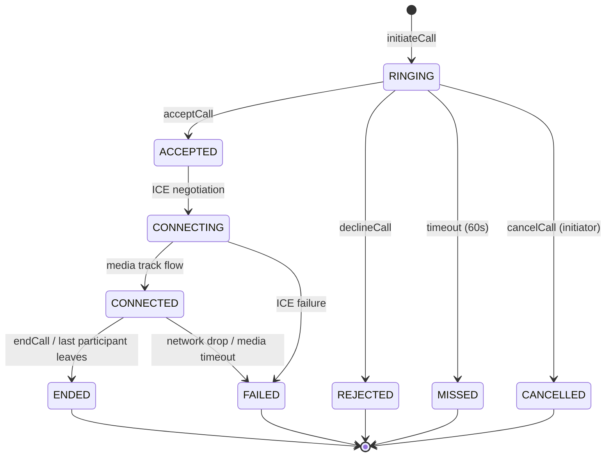
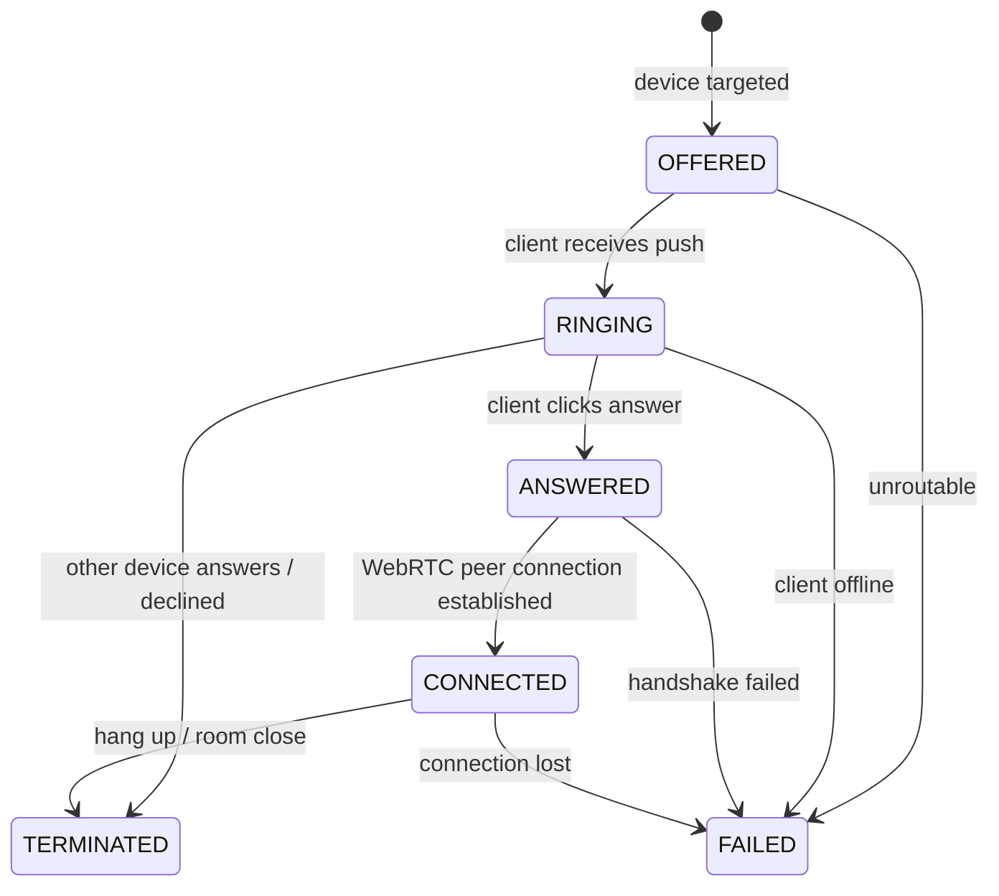
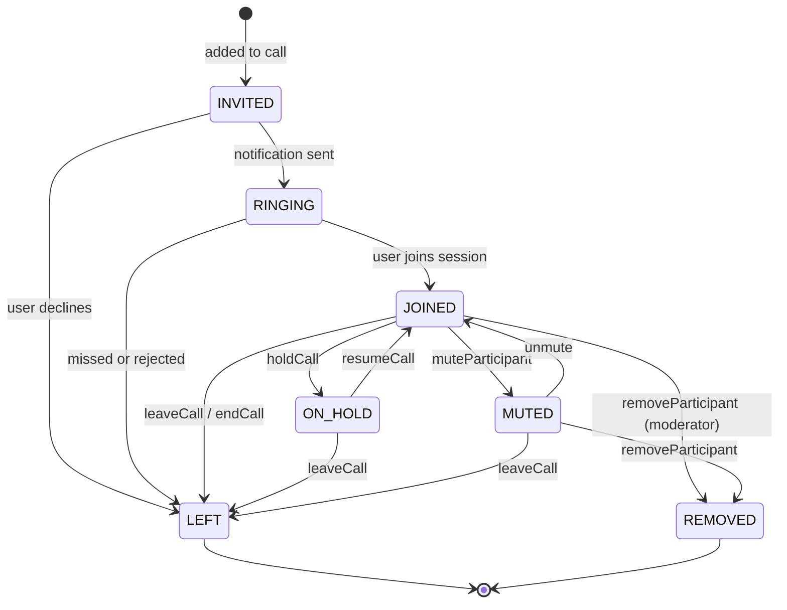
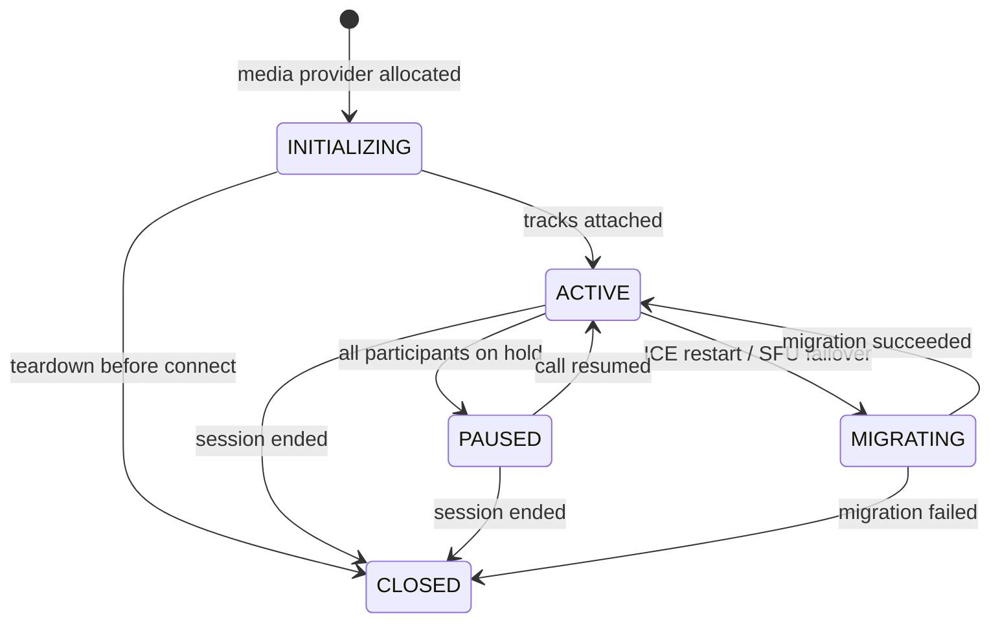
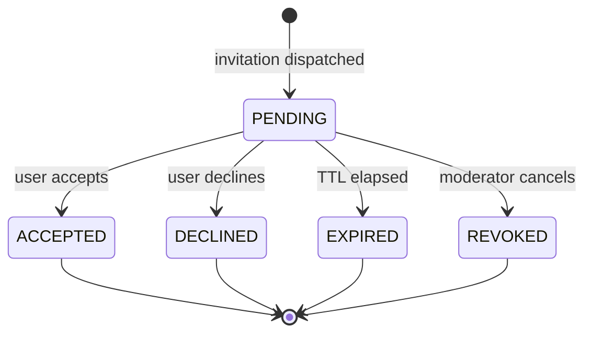

# NexaVoice Architecture — Call State Machines (Milestone 4)

## 1. State Machine Philosophy & Rules

NexaVoice enforces **strict, server-authoritative, deterministic finite state machines** for all calling entities. No state mutation can bypass the validation engine implemented in `CallStateMachineService` and typed in `@nexavoice/domain-types`.

### Core Rules:
1. **No Wildcard Transitions**: Only explicitly declared transitions in the transition matrices are permitted.
2. **Deterministic Exception Handling**: Any illegal state transition immediately throws an `InvalidCallStateTransitionException` and rejects the database transaction.
3. **Idempotent No-Ops**: If an entity is already in the requested state (e.g. `MUTE` on an already muted participant), the state machine returns gracefully without creating duplicate events.
4. **Audit Trail**: Every valid transition records an immutable `CallEvent` containing the previous state, new state, actor ID, and timestamp.

---

## 2. Entity State Transition Matrices

### 2.1 CallSession State Machine

| Source State | Permitted Destination States |
| :--- | :--- |
| `RINGING` | `ACCEPTED`, `REJECTED`, `MISSED`, `CANCELLED` |
| `ACCEPTED` | `CONNECTING`, `ENDED`, `FAILED` |
| `CONNECTING` | `CONNECTED`, `FAILED`, `ENDED` |
| `CONNECTED` | `ENDED`, `FAILED` |
| `ENDED` | *(Terminal)* |
| `FAILED` | *(Terminal)* |
| `REJECTED` | *(Terminal)* |
| `MISSED` | *(Terminal)* |
| `CANCELLED` | *(Terminal)* |

---

### 2.2 CallLeg State Machine

Tracks each distinct device endpoint (browser tab, mobile app, desktop client) in the call.

---

### 2.3 CallParticipant State Machine

Tracks each user's membership and audio/video status within the call.

---

### 2.4 MediaSession State Machine

Tracks the underlying media transport session lifecycle:

---

### 2.5 CallInvitation State Machine

Tracks invitations sent to users for group calls or rooms:

---

## 3. Server Validation Implementation

The state transitions are enforced in code at two layers:
1. **Pure TypeScript Domain Layer** (`packages/domain-types/src/calling.ts`):
   - `isValidCallSessionTransition(from, to)`
   - `isValidCallLegTransition(from, to)`
   - `isValidCallParticipantTransition(from, to)`
   - `isValidMediaSessionTransition(from, to)`
   - `isValidCallInvitationTransition(from, to)`
2. **NestJS Service Layer** (`CallStateMachineService`):
   - Atomically updates Prisma database records.
   - Throws `InvalidCallStateTransitionException` if invalid.
   - Creates `CallEvent` record in same transaction.
