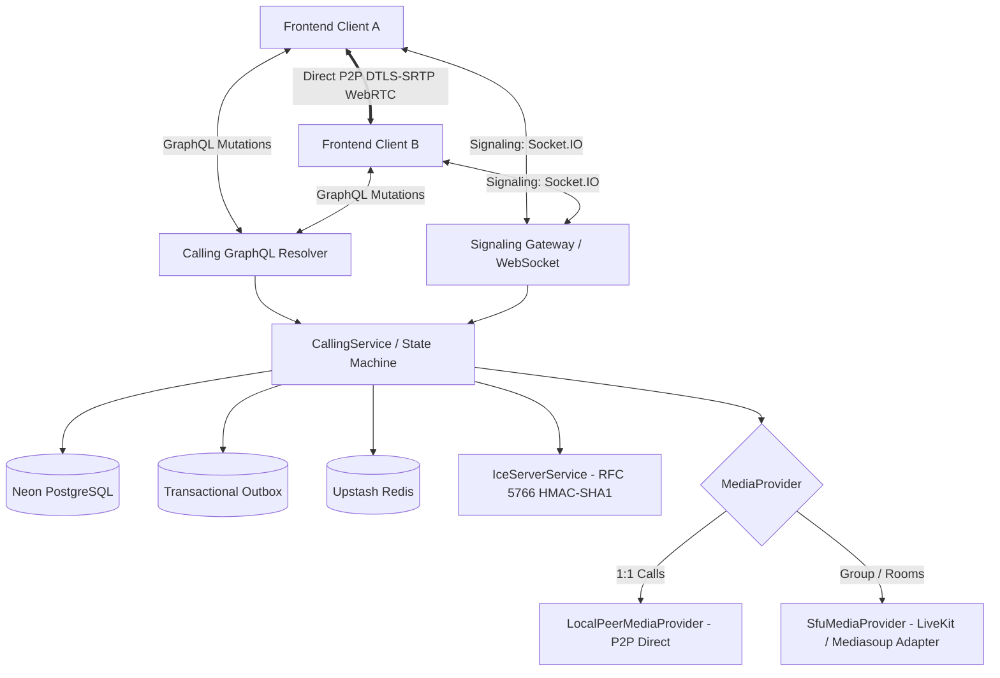

# NexaVoice Architecture — Calling Subsystem (Milestone 4)

## 1. Overview & Architectural Goals

The NexaVoice Calling subsystem provides a provider-independent, deterministic, highly reliable voice and video calling foundation. It is designed to cleanly decouple:

1. **Signaling & Session Control** (Server-authoritative state machines, NestJS, GraphQL, Socket.IO)
2. **Media Topology & Transport** (`MediaProvider` abstraction: Direct P2P WebRTC vs. Selective Forwarding Unit / SFU)
3. **Client Presentation & State** (TanStack Router, TanStack Query, typed hooks, `RTCPeerConnection` encapsulation)



---

## 2. Core Domain Models & Entities

All calling data structures are persisted in the database via Prisma (`schema.prisma`):

| Model | Purpose | Lifecycle State Machine |
| :--- | :--- | :--- |
| `CallSession` | Top-level call instance (1:1, Group, Room). | `RINGING` -> `ACCEPTED` -> `CONNECTING` -> `CONNECTED` -> `ENDED` / `FAILED` / `REJECTED` / `MISSED` |
| `CallLeg` | Per-device / per-endpoint leg participating in the call. | `OFFERED` -> `RINGING` -> `ANSWERED` -> `CONNECTED` -> `TERMINATED` / `FAILED` |
| `CallParticipant` | User membership within a call session. | `INVITED` -> `RINGING` -> `JOINED` -> `ON_HOLD` -> `MUTED` -> `LEFT` / `REMOVED` |
| `MediaSession` | Transport & media track descriptors (audio/video/screenshare). | `INITIALIZING` -> `ACTIVE` -> `PAUSED` -> `MIGRATING` -> `CLOSED` |
| `CallInvitation` | Async invitation extended to a user or room. | `PENDING` -> `ACCEPTED` -> `DECLINED` -> `EXPIRED` -> `REVOKED` |
| `CallRoom` | Named or persistent audio/video space. | `SCHEDULED` -> `ACTIVE` -> `IDLE` -> `ARCHIVED` |
| `CallTransfer` | Supervised or blind transfer orchestration. | `INITIATED` -> `RINGING` -> `TRANSFERRED` -> `FAILED` -> `CANCELLED` |
| `CallEvent` | Immutable forensic audit log of all call state changes. | Append-only event log. |

---

## 3. Media Provider Abstraction

NexaVoice isolates media negotiation behind the `MediaProvider` interface:

```typescript
export interface MediaProvider {
  readonly providerType: 'LOCAL_PEER' | 'SFU';
  initializeSession(params: InitializeMediaSessionParams): Promise<MediaSessionResult>;
  allocateIceServers(userId: string): Promise<IceServerConfig[]>;
  generateParticipantToken(params: GenerateParticipantTokenParams): Promise<MediaParticipantToken>;
  terminateSession(callSessionId: string): Promise<void>;
  updateParticipantTracks(params: UpdateTracksParams): Promise<void>;
}
```

### 3.1 LocalPeerMediaProvider (🟢 IMPLEMENTED + VALIDATED)
- Used for **1:1 audio and video calls**.
- Relies on direct browser-to-browser WebRTC via DTLS-SRTP.
- Allocates STUN (Google STUN) and ephemeral TURN credentials via `IceServerService` (RFC 5766 HMAC-SHA1).
- Out-of-band SDP offer/answer and trickle ICE candidate relay through `SignalingGateway`.

### 3.2 SfuMediaProvider (🟣 PROVIDER-DEPENDENT)
- Used for **group calls** and **persistent rooms** with up to 100 participants.
- Generates cryptographically signed access tokens (LiveKit / mediasoup compatible).
- Eliminates client bandwidth exhaustion by routing media through an SFU downlink/uplink mesh.

---

## 4. End-to-End Call Lifecycle

### 4.1 1:1 Call Initiation Flow
1. **Mutation**: Caller invokes `initiateCall({ recipientId, type: AUDIO | VIDEO })`.
2. **Authorization**: `CallingAuthorizationService` verifies active user status and contact/DM policies.
3. **Session Creation**: `CallSession` is persisted in `RINGING` state; `CallLeg` is created for caller.
4. **Outbox Event**: `call.initiated` is written to `OutboxEvent` within the same database transaction.
5. **Multi-Device Ringing**: `SignalingGateway` broadcasts `call:incoming` to all active sockets of the recipient.
6. **Recipient Action**:
   - **Accept**: Recipient invokes `acceptCall(callId)`. Status transitions to `ACCEPTED` -> `CONNECTING`. ICE servers are issued. Sockets join the call room. SDP offer/answer exchange begins.
   - **Decline**: Recipient invokes `declineCall(callId)`. Status transitions to `REJECTED`. Ringing sockets are cancelled.
   - **Timeout (60s)**: If unanswered, transitions to `MISSED`.

### 4.2 Group Call / Room Flow
1. Caller invokes `initiateCall({ type: GROUP_VOICE | GROUP_VIDEO, participantIds, roomId })`.
2. `CallSession` created with `SFU_ROUTED` mode.
3. Each participant receives an invitation and multi-device ring.
4. As users join, `CallParticipant` records update to `JOINED`.
5. Participants receive SFU connection tokens and publish/subscribe to tracks.

---

## 5. Transactional Integrity & Auditability

All state transitions are:
1. Validated by `CallStateMachineService` against immutable transition matrices.
2. Persisted atomically in Neon PostgreSQL.
3. Accompanied by an immutable `CallEvent` record logging actor, event type, and JSON metadata.
4. Published via `OutboxEvent` to ensure distributed delivery to Redis and Socket.IO without dual-write inconsistencies.
