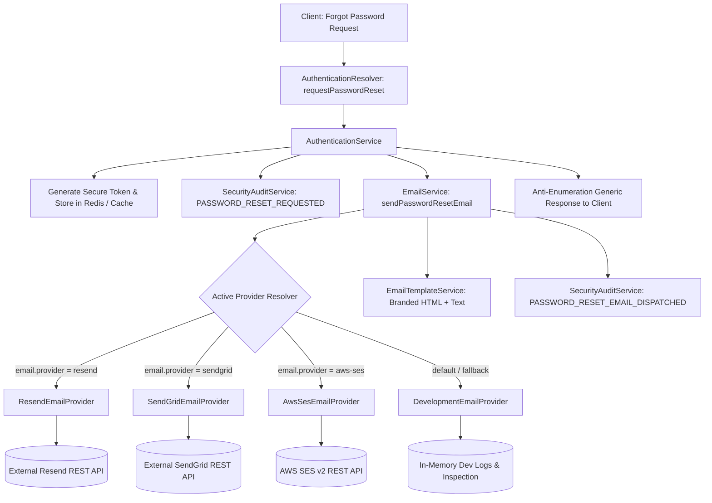

# NexaVoice — Outbound Transactional Email Delivery Architecture

## 1. Overview & Objectives

In NexaVoice, account recovery, security verifications, and user lifecycle events require robust transactional email delivery. While security tokens are generated, hashed, and stored in Redis/memory with audit logging, delivering these emails to external user inboxes is critical for real-world production deployments.

This integration delivers a multi-provider transactional email subsystem adhering to NexaVoice's provider abstraction pattern (mirroring `MediaProvider` and `ObjectStorageProvider`), with support for:
- **Resend** (REST API v1)
- **SendGrid** (v3 Mail API)
- **AWS SES** (SES v2 Outbound Email API with native AWS SigV4 signing)
- **Development / Sandbox Fallback** (in-memory capture and structured logging)

---

## 2. Architecture & Design Principles

### Key Design Tenets
1. **Zero Heavy External Dependencies**: Provider adapters communicate directly over native HTTP `fetch` and Node standard libraries (`crypto`), keeping container bundles small and secure without SDK bloat.
2. **Anti-Enumeration Security Boundary**: As specified in NexaVoice security policies, whether a user exists or not, and whether an email delivery succeeds or encounters a temporary gateway error, the API response returned to the client is uniform (`{ success: true, message: "If an account exists with this email..." }`).
3. **Structured Observability**: All outbound dispatches, failures, and provider message IDs are logged through `StructuredLogger` and tracked as `PASSWORD_RESET_EMAIL_DISPATCHED` in `SecurityAuditService`.
4. **Environment Portability**: If no external provider API keys are configured, the system gracefully falls back to `DevelopmentEmailProvider` so local dev and automated CI pipelines run without cloud credentials.

---

## 3. Configuration Reference

All settings can be configured via environment variables or loaded through NestJS `ConfigModule`:

| Environment Variable | Description | Default |
|---|---|---|
| `EMAIL_PROVIDER` | Active provider: `development`, `resend`, `sendgrid`, `aws-ses` | `development` |
| `EMAIL_FROM` | Sender address shown in client inboxes | `NexaVoice Security <security@nexavoice.io>` |
| `FRONTEND_URL` | Base URL used to build reset and verification links | `http://localhost:3000` |
| `RESEND_API_KEY` | Resend API key (starts with `re_...`) | Optional |
| `SENDGRID_API_KEY` | SendGrid API key (starts with `SG....`) | Optional |
| `AWS_SES_REGION` | AWS Region for SES (e.g. `us-east-1`, `eu-west-1`) | `us-east-1` |
| `AWS_ACCESS_KEY_ID` | AWS IAM Access Key ID with `ses:SendEmail` permissions | Optional |
| `AWS_SECRET_ACCESS_KEY`| AWS IAM Secret Access Key | Optional |
| `AWS_SESSION_TOKEN` | Optional AWS STS Session Token (for temporary IAM roles) | Optional |

---

## 4. Email Template Features

The `EmailTemplateService` generates dual-format payloads:
- **Responsive HTML**:
  - Gradient header (`#6366f1` Indigo to `#06b6d4` Cyan) matching the NexaVoice brand aesthetic.
  - Prominent Call to Action button (`Reset Password`).
  - Security warning highlighting 60-minute single-use validity.
  - IP address audit stamp (`Requested from IP: <ip>`) for user security verification.
  - Copy-paste fallback URL for mail clients blocking HTML buttons.
- **Plaintext Alternative**: Ensures readability on screen readers and text-only mail clients.

---

## 5. Verification & Test Suite

All email providers and authentication integrations are verified by automated test suites:
- `backend/apps/api/src/modules/email/email.service.spec.ts` (12/12 tests PASS)
  - Dynamic provider selection based on environment configuration.
  - HTML & plaintext template rendering.
  - In-memory development provider inspection.
  - Resend REST API v1 payload validation.
  - SendGrid v3 mail API payload validation.
  - AWS SES v2 SigV4 signed request validation.
- `backend/apps/api/src/modules/authentication/password-reset.spec.ts` (6/6 tests PASS)
  - Full end-to-end token issue, audit dispatch, and email routing verification.
