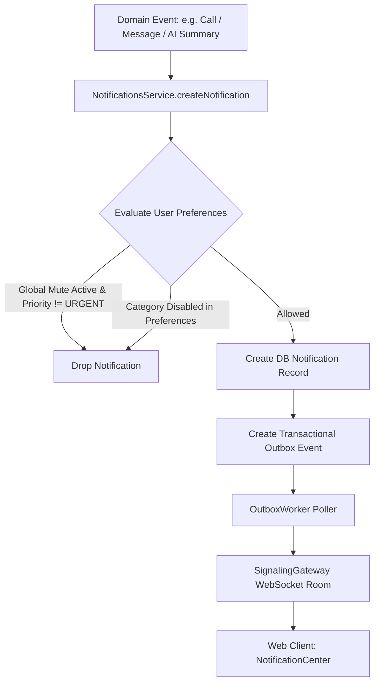

# NexaVoice Architecture: Multi-Channel Notifications & Preferences

## 1. Overview
The Notification system in NexaVoice provides reliable, prioritized, and preference-guarded user notifications across system events, chat messages, incoming calls, contact requests, and AI summaries.

## 2. Preference Hierarchy & Filtering Rules
Before any notification is stored or dispatched, `NotificationsService` evaluates user preferences:

- **Global Mute / Do Not Disturb**:
  - If `globalMute === true` and `muteUntil` is either indefinite or in the future:
    - **`URGENT`** notifications (e.g. emergency calls, critical security alerts) bypass the mute and are delivered.
    - All other notifications (`LOW`, `NORMAL`, `HIGH`) are suppressed.
- **Category Preferences**:
  - `MESSAGE`: Checked against `messagesInApp`.
  - `CALL_INCOMING`, `MISSED_CALL`: Checked against `callsInApp`.
  - `CONTACT_REQUEST`, `CONTACT_ACCEPTED`: Checked against `contactRequestsInApp`.
  - `MENTION`: Checked against `mentionsInApp`.
  - `AI_SUMMARY`: Checked against `aiSummariesInApp`.

## 3. Real-Time Delivery & Outbox Guarantees
- Notifications use the canonical **Transactional Outbox** pattern.
- Database write and Outbox event creation occur atomically.
- `OutboxWorker` reads `aggregateType === 'User'` events and emits `notification.created` directly to the recipient's multi-device room `user:${recipientId}` in Socket.IO.
- Zero lost notifications during transient network disconnections.

## 4. GraphQL API Surface
- **Queries**:
  - `notifications(limit, offset, unreadOnly)`: Paginated list with actor resolution.
  - `unreadNotificationCount`: Unread badge counter.
  - `notificationPreferences`: User preferences object.
- **Mutations**:
  - `markNotificationAsRead(id)`: Sets `isRead: true` and `readAt: now()`.
  - `markAllNotificationsAsRead()`: Bulk read update.
  - `updateNotificationPreferences(input)`: Upserts user notification settings.
