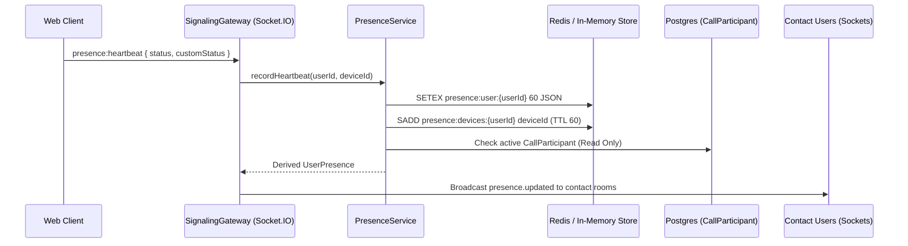

# NexaVoice Architecture: Ephemeral Presence & Availability Engine

## 1. Overview & First Principles
Presence in NexaVoice provides real-time awareness of user state across devices while strictly adhering to the architectural requirement of **Zero Database Write Amplification**. Status updates and periodic heartbeats must never generate write operations to persistent disk storage (PostgreSQL).

## 2. Multi-Device Aggregation
A single user may have multiple simultaneous client connections (desktop browser, mobile PWA, secondary browser tab). 

- **Device Registry**: Ephemeral set `presence:devices:{userId}` stores active device IDs with a 60-second TTL.
- **Heartbeat Contract**: Clients emit `presence:heartbeat` every 30 seconds.
- **Disconnection Handling**: When a device socket disconnects, its device ID is removed from the active set. Only when the device count reaches zero does the user transition to `OFFLINE`.

## 3. Availability Derivation Precedence
User availability is computed deterministically by synthesizing durable preferences, ephemeral activity, and real-time calling participation:

1. **`IN_CALL`**: Highest precedence. If user has an active `CallParticipant` record in state `CONNECTED`, `JOINED`, or `MUTED`, availability is always derived as `IN_CALL`, regardless of whether their manual status is `ONLINE`.
2. **`DO_NOT_DISTURB`**: Set when user has enabled global mute or explicit DND.
3. **`BUSY`**: Explicit manual status selection.
4. **`AVAILABLE`**: Active heartbeats present with status `ONLINE`.
5. **`UNAVAILABLE`**: Heartbeat TTL expired or all devices disconnected (`OFFLINE`).

## 4. Privacy & Access Control
Presence visibility is strictly enforced by zero-trust guards:
- `EVERYONE`: Publicly discoverable across the organization directory.
- `CONTACTS_ONLY`: Presence broadcasts are restricted solely to users with an `ACCEPTED` contact relationship.
- `NOBODY`: Always returns `OFFLINE` / `UNAVAILABLE` to other callers.

## 5. Storage & Failover Architecture
- **Primary**: Distributed Redis cluster using `SETEX` keys with 60-second automatic expiry.
- **Fallback**: Thread-safe in-memory map with background eviction timer for local development or single-node deployments.
