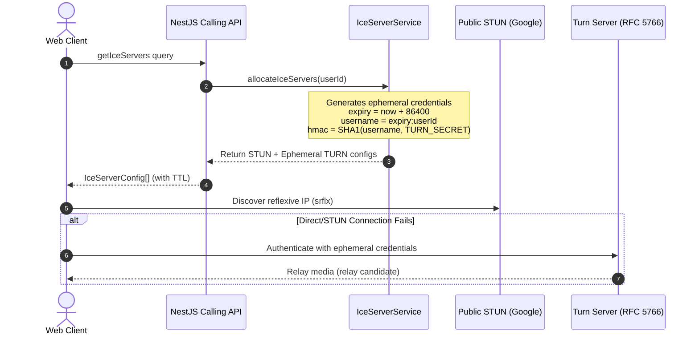

# NexaVoice Architecture — WebRTC Subsystem (Milestone 4)

## 1. WebRTC Protocol Stack & Standards

NexaVoice's WebRTC implementation adheres strictly to RFC standards:
- **Transport**: UDP with ICE (RFC 8445), STUN (RFC 5389), and TURN (RFC 5766).
- **Security**: DTLS 1.2+ (RFC 6347) handshake establishing keys for SRTP (RFC 3711) media encryption.
- **Signaling**: JSON-over-WebSocket signaling via Socket.IO, zero-trust authenticated.
- **Audio Codec**: Opus (48 kHz, full-band, dynamic bitrate 6-510 kbps, DTX enabled).
- **Video Codec**: VP8 / H.264 / VP9 with simulcast capabilities for SFU mode.

---

## 2. ICE & TURN Architecture

To guarantee NAT/firewall traversal across symmetric NATs, cellular carriers, and enterprise networks, NexaVoice uses a dual-tier ICE strategy:



### RFC 5766 Ephemeral TURN Credential Generation
```typescript
const expiryTimestamp = Math.floor(Date.now() / 1000) + ttlSeconds;
const username = `${expiryTimestamp}:${userId}`;
const credential = crypto
  .createHmac('sha1', turnSecret)
  .update(username)
  .digest('base64');
```
This ensures:
- No shared static passwords are ever exposed to client browsers.
- Credentials automatically expire after 24 hours.
- Credentials cannot be used by unauthorized third parties.

---

## 3. Frontend WebRTC Implementation (`WebRtcPeerService`)

The browser WebRTC lifecycle is encapsulated in `apps/web/src/features/calling/services/webrtc-peer.service.ts`:

### 3.1 Key Responsibilities
1. **Connection Lifecycle**: Instantiates `RTCPeerConnection` with ICE server list, monitors `connectionstatechange`, `iceconnectionstatechange`, and `icegatheringstatechange`.
2. **Track Management**:
   - `addLocalStream(stream)`: Iterates over tracks and attaches them via `peerConnection.addTrack(track, stream)`.
   - `replaceTrack(kind, newTrack)`: Seamlessly swaps audio/video tracks (e.g., camera to screen share or switching microphones) without renegotiation using `RTCRtpSender.replaceTrack`.
   - `toggleAudio(enabled)` / `toggleVideo(enabled)`: Local muting at track level.
3. **Offer / Answer Exchange**:
   - `createOffer()`: Generates SDP offer, sets local description, returns SDP.
   - `handleOffer(sdp)`: Sets remote description, creates SDP answer, sets local description, returns SDP.
   - `handleAnswer(sdp)`: Sets remote description.
4. **Trickle ICE**:
   - Listens to `peerConnection.onicecandidate` and fires `onIceCandidate` callback.
   - Buffers remote candidates if remote description is not yet set, then flushes them via `peerConnection.addIceCandidate`.
5. **Teardown**:
   - Closes `RTCPeerConnection`, removes all event listeners, stops all sender tracks, clears candidate buffer.

---

## 4. Media Device Management

NexaVoice provides rich client-side hardware device management through three custom hooks:
- `useLocalMedia`: Acquires user media via `navigator.mediaDevices.getUserMedia`, handles permission denials gracefully with informative toast feedback, and falls back to audio-only if video is rejected.
- `useScreenShare`: Captures screen stream via `navigator.mediaDevices.getDisplayMedia`, tracks the system stop event (`track.onended`), and swaps the video track back to the camera.
- `useDeviceManager`: Enumerates available audio inputs, audio outputs, and video inputs via `navigator.mediaDevices.enumerateDevices`, listens for device plug/unplug events (`devicechange`), and enables audio output routing via `HTMLAudioElement.setSinkId` where supported.
